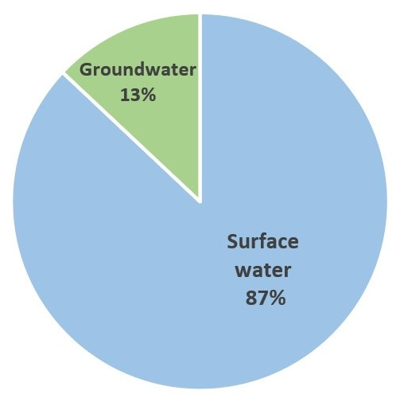
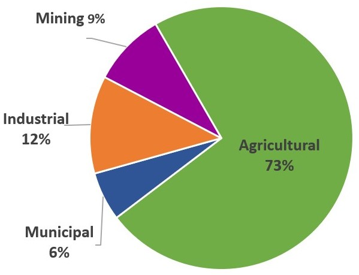
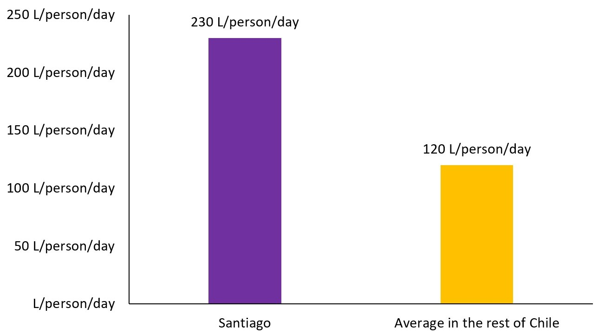

```{r, message = FALSE, warning = FALSE, echo = FALSE}
library(tidyverse)
library(readr)
library(stringr)
library(ggrepel)
library(ggthemes)
library(scales)
library(knitr)
library(rmarkdown)
library(mikedown)
```

***

<br>

# **Overview of Chile:**
***
##### Chile is a South American country with a variety of climates, a moderately sized, predominantly urban population, and a growing economy. Chile spans ~40° of latitude leading to various climates: dry deserts in the north, a Mediterranean climate in the center and a wet, humid climate in the south (Figure 1) (1). Chile is ~750,000 km2, with 21% of land dedicated to agriculture (2, 3). Precipitation varies from the North to the South (Figure 2) (1, 2). The rainy season is from June to September. Chile has a population of ~17 million and 87% of the population lives in central Chile around the cities of Santiago and Valparaiso. The northern and southern regions are rural and scarcely populated (2). Over the last 30 years Chile’s GDP has risen 6% annually (3).  Chile’s economy is based on foreign trade and exports of its mining and agricultural resources (2, 3). Water demands are expected to increase as Chile’s economy continues to grow around water intensive industries, while water supply is expected to decrease.

***


<br>
<br>
<br>
<br>

```{r, message = FALSE, warning = FALSE, echo = FALSE, fig.align="center", fig.cap='**Figure 1:** Chile’s location within the South American continent. Chile lies on the southwestern portion of South America, bordered by the Pacific Ocean on the west, Peru on the north, Bolivia on the northeast, Argentina on the west and River valleys run east-west from the Andes Mountains to the Pacific Ocean.  Chile is the longest country in the world, covering 2,653 miles north to south and 217 miles east to west.  The predominant agricultural region is around the Santiago metropolitan area. Data from ref (1).'}

```

***

<br>
<br>
<br>
<br>
<br>
<br>
<br>
<br>

```{r, message = FALSE, warning = FALSE, echo = FALSE, fig.align="center", fig.width=10, fig.height=8, fig.cap='**Figure 2:** Regional average annual precipitation in mm/year. This figure shows the latitudinal variation in annual precipitation rates, resulting in Chile having three distinct climatological zones: Average Annual precipitation ranges from >20mm/year in the Northern regions to over 3000mm/year in parts of Southern Chile. Chile’s irregular hydrology leads to regional water availability variations, particularly in densely populated Central Chile. Data from ref (1). Figure from (7).'}

include_graphics('../img/fig-2.4.jpg')
```


***


<br>
<br>
<br>
<br>

# **Water Supply in Chile:**

***

##### Most of Chile’s water supply is comprised of surface waters (Figure 3) (1, 4). Chile’s surface water resources are comprised of rivers, lakes, and reservoir storage (4). Annual precipitation, River runoff, and water losses due to evaporation vary with latitude (Figure 4), consequently, so does water availability (Figure 5) (3, 4). The northern rivers are fed by snow melt, central rivers are fed by snow melt and rain, and southern rivers are fed by rain (Figure 5) (4, 5). Northern groundwater aquifers are comprised of fossil water and experience minimal recharge from surface waters (3). 

***


<br>
<br>
<br>
<br>

```{r, message = FALSE, warning = FALSE, echo = FALSE, fig.align="center", fig.width=5, fig.height=4, fig.cap='**Figure 3:** Distribution of renewable water resources in Chile. Comparison between total renewable surface water and groundwater resources in Chile in millions of cubic meters per year. Chile’s renewable water resources is comprised of 87% (923,100 million m3 per year) surface water and 13% (140000 million m3 per year) groundwater.  Data from ref (1).'}

```

***

<br>
<br>
<br>
<br>
<br>
<br>
<br>
<br>

```{r, message = FALSE, warning = FALSE, echo = FALSE, fig.align="center", fig.width=10, fig.height=8, fig.cap='**Figure 4:** Precipitation, Runoff, and Evaporation water balances across Chile’s three regions in m3/s. The water balance compares precipitation received to the amount of water that runoffs off to the ocean or is evaporated. Dramatic differences can be seen in Chile. In the north, most of the water is lost through evaporation from surface waters. In Central Chile roughly a third of water is lost to evaporation and two thirds flow to the ocean. In the South, there are abundant surface water resources that run off to the ocean; the south has population density is very low population density and minimal irrigation demands. Figure from (7).'}


```

***

<br>
<br>
<br>
<br>
<br>
<br>
<br>
<br>

```{r, message = FALSE, warning = FALSE, echo = FALSE, fig.align="center", fig.width=10, fig.height=8, fig.cap='**Figure 5:** Regional water availability per capita. The Aysen and Magallanes regions are not shown due to the small populations. The red dotted line indicates the recommended threshold value of 1,000m3/person/year of freshwater resources. Water availability in the central regions where ~80% of the population lives does meet this threshold. The Santiago metropolitan region experiences less than 800m3/person/year. Water availability increases southbound, with low water available in the North and Central regions and high-water availability in the south. South of the Metropolitan region water availability reaches levels over 10,000m3/person/year, however these southern regions are scarcely populated and demand less water (3, 7). Figure from (7).'}

```

***

<br>
<br>
<br>
<br>

# **Water Demands in Chile:**
***
##### In Chile, the primary water demands are for energy and agriculture, followed by city and environmental demands (Figure 6). Water use in Chile differs regionally; the mining and industrial sectors are concentrated in the north, while large scale agricultural is in central Chile (Figure 7) (1, 7). Irrigation makes up ~73% of water consumption in Chile (Figure 6). Municipal water demands are greatest near the capital, Santiago (Figure 8) (3). Decreased water quality from pollution and decreased stream flows from upstream dams have put stress on river and groundwater ecosystems (4, 9).

***


<br>
<br>
<br>
<br>

```{r, message = FALSE, warning = FALSE, echo = FALSE, fig.align="center", fig.width=5, fig.height=4, fig.cap='**Figure 6:** Chile’s water withdrawals by sector in millions of cubic meters per year. Agriculture is the dominant source of water withdrawals. Mineral mining and industrial processing require thermoelectric energy, which demands cooling water. Chile’s irrigated agriculture water demands are met by surface waters, with small amounts of groundwater irrigation occurring in rural communities in the north and south. Data reflects measurements from 2006. Data from (1).'}

```

***

<br>
<br>
<br>
<br>
<br>
<br>
<br>
<br>

```{r, message = FALSE, warning = FALSE, echo = FALSE, fig.align="center", fig.width=10, fig.height=8, fig.cap='**Figure 7:** Percentage of irrigation, municipal, industrial, and mining water use by region. Chile’s mining industry is concentrated in the north; mining is a large proportion of water withdrawals. In the north, groundwater is used to meet water demands from mining operations. Mining is Chile’s most important economic industry, and subsequently is the largest demander of water. Irrigation is the primary water demander in central Chile. Per capita municipal water demands are greatest in the Valparaiso and Metropolitan regions. Figure from (7).'}

```

***

<br>
<br>
<br>
<br>
<br>
<br>
<br>
<br>

```{r, message = FALSE, warning = FALSE, echo = FALSE, fig.align="center", fig.width=5, fig.height=4, fig.cap='**Figure 8:** Municipal water use in the Santiago metropolitan area compared to the average in the rest of the country in L/person/day. Per capita water demands in Santiago are nearly double that of the average throughout the rest of Chile. Data from (7).'}

                                    
```

***

<br>
<br>
<br>
<br>

# **Anthropogenic Drivers of Change in Chile:**
***
##### Climate change, population growth, increased economic activity, and poor collaboration amongst users will impact Chile’s water supplies and demands over the next century. Climate projections show an average temperature increase of ~2.5˚C with annual precipitation decreasing 30 percent by 2070-2100 (Figure 9) (3, 7, 10). Chile’s population is growing, increasing demand for potable water and increased surface water runoff from expanding urban areas (Figure 10) (5, 11). Chile’s natural resource-based economy is growing, increasing water demands (Figure 11) (4, 7, 12). A lack of administrative communication amongst water users affects water quality and quantity for downstream users (3, 4, 7).
***
<br>

```{r, message = FALSE, warning = FALSE, echo = FALSE, fig.align="center", fig.width=10, fig.height=8, fig.cap='**Figure 9:** Climate change projections in Chile for the next century showing increasing average temperatures (a) and decreasing precipitation (b). (a) Projected average temperatures through 2099 shows temperature increases of ~2.5 ˚C throughout the north-central regions of Chile. (b) Projected annual precipitation change, shows a 20-30% drop in annual precipitation by 2100 through most of Chile. Small pockets in the North and South showing increased precipitation. Increased temperature and decreased precipitation result in reduction in mountain runoff, reduction in snowpack, retreating glaciers, and an increase in the frequency and intensity of drought-flood scenarios. Figure from (7).'}

```

***

<br>
<br>
<br>
<br>

```{r, message = FALSE, warning = FALSE, echo = FALSE, fig.align="center", fig.width=7.5, fig.height=6, fig.cap='**Figure 10:** Population growth in Chile from 1950 to 2020, with projected population growth into 2050. The United Nations reports several variants of population projections, the medium variant is mean value within a 95% confidence interval. Chile’s population is projected to grow by approximately 5 percent by 2050. Data from (11).'}
total_pop = read_csv('../data/total-pop.csv') %>% 
  select(country = Location, pop = PopTotal, pop_density = PopDensity, year = Time, Variant) %>% 
  filter(country == 'Chile', year <= 2050) %>% 
  filter(!Variant %in% c('Constant fertility', 'Instant replacement', 'Zero migration', 
                         'Constant mortality', 'No change', 'Momentum', 'Median PI', 'Upper 80 PI', 'Lower 80 PI', 'Upper 95 PI', 'Lower 95 PI'))
past_pop = total_pop %>% 
  filter(Variant == 'Medium', year <= 2050) %>% 
  mutate(pop = pop *1000)

med = total_pop %>% 
  filter(Variant == 'Medium') %>% 
  mutate(pop = pop *1000)


low = total_pop %>% 
  filter(Variant == 'Low')%>% 
  mutate(pop = pop *1000)


high = total_pop %>% 
  filter(Variant == 'High')%>% 
  mutate(pop = pop *1000)


current_pop = past_pop %>% filter(year == 2020)

medium_pop = med %>% filter(year == 2050)
# plot population projections

pop_projection = past_pop %>% ggplot(aes(x = year, y = pop)) +
  geom_line(aes(y = pop), col = 'darkcyan', size = 1.25) +
  geom_line(data = low, aes(y = pop), col = 'darkcyan', size = 1.25) +
  geom_line(data = high, aes(y = pop), col = 'darkcyan', size = 1.25) +
  geom_point(data = current_pop, aes(x = year, y = pop), color = 'red', size = 3) +
  geom_label_repel(data = current_pop, aes(label = pop), hjust = 1.3, 
                   box.padding   = 0.35, 
                   point.padding = 0.5,
                   label.size = 1,
                   segment.color = 'grey50', size = 5) +
  geom_point(data = medium_pop, aes(x = year, y = pop), color = 'red', size = 3) +
  geom_label_repel(data = medium_pop, aes(label = pop), hjust = 1, 
                   box.padding   = 0.35, 
                   point.padding = 0.5,
                   label.size = 1,
                   segment.color = 'grey50', size = 5) +
  scale_y_continuous(name = 'Population', labels = comma) +
  labs(title = "Projected population growth (1950 - 2050)",
       x = "Year",
       y = "Population",
       subtitle = 'Data Source: United Nations',
       color = "") +
  theme_economist() +
  theme(plot.title=element_text(size=20,face="bold", vjust=1.5, lineheight=1.6),
        axis.text=element_text(size=13),
        axis.title=element_text(size=14,face="bold"), axis.title.x = element_text(color="black", vjust= 1), axis.title.y = element_text(color="black", vjust= 1),
        legend.text = element_text(size = 12, face = 'b')) +
  theme(aspect.ratio = 0.75)
pop_projection
```

***

<br>
<br>
<br>
<br>
<br>
<br>
<br>
<br>

```{r, message = FALSE, warning = FALSE, echo = FALSE, fig.align="center", fig.width=7.5, fig.height=6, fig.cap= "**Figure 11:** Gross Domestic Product in USD in Chile from 1980-2020 with projections through 2024. Gross domestic product denotes the aggregate value of all services and goods produced within a country in any given year. GDP is an important indicator of a country's economic power. Red markers indicate Chile’s GDP in 2002, 2006, 2020 and the 2024 projection – where we saw GDP double over the period of interest. Mining, food and chemical processing industries, and agriculture are the largest components of Chile’s economy; all of which are growing and subsequently so are their respective water withdrawals. Data from (12)."}

gdp = read_csv('../data/chile-gdp.csv')
gdp = gdp %>% pivot_longer(cols = everything(), names_to = 'year', values_to = 'gdp') 

highlight = gdp %>% 
  filter(year %in% c('2002', '2006', '2020', '2024'))

gdp_plot = gdp %>% ggplot(aes(x = year, y = gdp, group = 1)) +
  geom_line(aes(y = gdp), col = 'darkgreen', size = 1.25) +
  scale_x_discrete(breaks = seq(1950, 2024, by = 5)) +
  geom_point(data = highlight, aes(x = year, y = gdp), color = 'red', size = 3) +
  geom_label_repel(data = highlight, aes(label = gdp), hjust = 1.3, 
                   box.padding   = 0.35, 
                   point.padding = 0.5,
                   label.size = 1,
                   segment.color = 'grey50', size = 5) +
  labs(title = "GDP in Chile (1980 - 2024)",
       x = 'Year',
       y = "GDP (billions in USD)",
       subtitle = 'Data Source: International Monetary Fund') +
  theme_economist() +
  theme(plot.title=element_text(size=20,face="bold", vjust=1.5, lineheight=1.6),
        axis.text=element_text(size=13),
        axis.title=element_text(size=14,face="bold"), axis.title.x = element_text(color="black", vjust= 1),
        axis.title.y = element_text(color="black", vjust= 1)) +
    theme(aspect.ratio = 0.75)

gdp_plot

```
***

<br>
<br>
<br>
<br>

# **Water Resource Opportunities in Chile:**

##### Chile has two key opportunities to combat its water challenges: increase water-use efficiency in agriculture and municipalities and develop cooperation among water users. Implementing microirrigation systems (Figure 12-13) and conservational agriculture practices (Figure 14) could increase agricultural water efficiency (6-8, 13). Chile can introduce incentives for reductions in water use, raise awareness on water issues, and create efficiency standards for buildings (3, 6). Chile can institute penalties on water overages and nonessential water consumption, and invest in upgrading piping infrastructure (6). Establishing integrated water management among water users can improve water allocation and reduce pollution (3, 4, 6).

***

<br>
<br>
<br>
<br>
<br>
<br>

```{r, message = FALSE, warning = FALSE, echo = FALSE, fig.align="center", fig.width=10, fig.height=8, fig.cap='**Figure 12:** Area equipped for surface, sprinkler, and microirrigation. Surface irrigation applies water at ~40-80 percent efficiency while micro irrigation applies water at ~8095 percent efficiency. Approximately 70 percent of Chiles agriculture is surface irrigated with efficiencies in the 35-40 percent range.   Data from (1)'}
include_graphics('../img/fig-12.jpg')
```

***

<br>
<br>
<br>
<br>
<br>
<br>
<br>
<br>


```{r, message = FALSE, warning = FALSE, echo = FALSE, fig.align="center", fig.width=10, fig.height=8, fig.cap='**Figure 13:** Irrigated areas in Chile in hectares and the associated irrigation efficiency. Irrigation efficiency is the overall efficiency of physical irrigation systems and is a composite of water conveyance efficiency and water application efficiency. The predominant agriculture areas in central Chile display irrigation efficiencies of ~35 percent, indicating the use of surface irrigation. Chile can invest in micro irrigation systems that will more efficiently use and subsequently, conserve water. Figure from (7). '}

```

***

<br>
<br>
<br>
<br>
<br>
<br>
<br>
<br>

```{r, message = FALSE, warning = FALSE, echo = FALSE, fig.align="center", fig.width=10, fig.height=8, fig.cap='**Figure 14:** Percentage of arable land area using conventional and conservational agricultural practices. Conservational agriculture is characterized by little to no tillage, usage of cover crops, and crop diversification. Conservation tillage and cover crops can increase soil moisture retention, decrease evaporative losses, and decrease surface runoff, thus increasing water conservation, and reducing the need for irrigation. Chile can increase conservation agriculture practices, which will improve soil ecosystems and reduce water demands. Data from (1).'}


```

***

<br>
<br>
<br>
<br>

# **Water Resource Tradeoffs in Chile:**

##### Chile faces tradeoffs if it is to implement changes to agricultural, residential, and water management practices discussed above. Replacing surface irrigation with micro irrigation would decrease agricultural water requirements and evaporative losses, however micro irrigation has a high initial cost and the departure from surface irrigation can decrease deep percolation into groundwater aquifers (Figure 15) (6, 13).  Implementing incentives and penalties will reduce water demands and lessen water stress on the environment, yet enacting these programs requires governmental oversite and is politically and socially unpopular (Figure 16) (6, 13, 14). Deteriorated pipes, poor infrastructure, and inaccuracies in water monitoring systems account for 22 percent of Chile’s avoidable water losses, however upgrading these systems requires substantial monetary and human capital investments (6, 15). Creating solidarity among administrative regions will cultivate sustainable water resource management solutions but would require cooperation between the Chilean government and the water users (3, 6).

***

<br>
<br>
<br>
<br>
<br>
<br>
<br>
<br>

```{r, message = FALSE, warning = FALSE, echo = FALSE, fig.align="center", fig.width=10, fig.height=8, fig.cap='**Figure 15:** Tradeoffs associated with Micro irrigation systems. Micro irrigation systems are highly efficient and have minor potential water losses, however micro irrigation systems require a costly upfront investment and regular maintenance. The potential benefits of efficiency and reduced water use often outweigh the costs of implementation if resources are available. Data from (6, 13).'}
include_graphics('../img/fig-15.jpg')
```

***

<br>
<br>
<br>
<br>
<br>
<br>
<br>
<br>

***

```{r, message = FALSE, warning = FALSE, echo = FALSE, fig.align="center", fig.width=10, fig.height=8, fig.cap='**Figure 16:** Methods to decrease water demands. Minimizing nonessential water uses like watering lawns and filling pools can reduce domestic water demands. Promoting water conservation through television, radio, billboards, and print media can motivate the population to reduce per capita water consumption. Offering rebates to Replace toilets, showerheads, and washing machines with water efficient models can reduce potable water use. Rebate programs and educational campaigns can decrease water demands but require the government to spend capital. Data from (6).'}

```

***

<br>
<br>
<br>
<br>
<br>
<br>
<br>
<br>

### **References:**

***

1.        Food and Agriculture Organization of the United Nations. (2015). AQUASTAT. Available at http://www.fao.org/nr/water/aquastat/data/query/index.html?lang=en Accessed [January 19, 2020].
2.        Central Intelligence Agency. (2016). Chile — The World Factbook. Available at https://www.cia.gov/library/publications/the-world-factbook/geos/ci.html Accessed [January 19, 2020].
3.        G. Donoso, Integrated water management in Chile. Departamento de Economía Agraria, Pontificia Universidad Católica de Chile, Santiago, Chile 217-233, (2014). 
4.        R. Valdés-Pineda, et al., Water governance in Chile: Availability, management and climate change. Journal of Hydrology 519, 2538–2567 (2014).
5.        Biblioteca del Congreso Nacional de Chile (2015) Integrated Territorial Information System. Available at https://www.bcn.cl/siit [Accessed January 24, 2020]
6.        A. E. Becerra Coauthors, et al., A New Course: Managing Drought and Downpours in the Santiago Metropolitan Region. National Resources Defense Council Inc (2019). 
7.	      Jiménez Cisneros B., Galizia Tundisi J. Diagnóstico del Agua en las Américas. Foro Consultivo Científico y Tecnológico, AC (2012).
8.	      D. Aitken, D. Rivera, A. Godoy- Faúndez, E. Holzapfel, Water Scarcity and the Impact of the Mining and Agricultural Sectors in Chile. Sustainability 1-18, (2016).
9. 	      E. O’Donnell, E. Macpherson, Challenges and opportunities for environmental water management in chile: An Australian perspective. Journal of Water Law 24-36, (2014).
10.	      Organization for Economic Cooperation and Development, “Chile Climate change impact on water systems” (Water and Climate Change Adaption OECD, 2013)
11.	      United Nations. (2019). World Population Prospects. Available at https://population.un.org/wpp/Graphs/DemographicProfiles/Line/152 Accessed [February 9, 2020]
12.	      International Monetary Fund. (2019). IMF DataMapper. Available at https://www.imf.org/external/datamapper/NGDP_RPCH@WEO/CHL?year=2020 Accessed [February 9, 2020]
13.	      Hornberger G.M., Perrone D. (2019) Water Resources – Science and Society (Johns Hopkins University Press, Baltimore, MD.).
14.	      G. Donoso, M. Molinos- Senante, Sistema tarifario de agua potable en Chile: una propuesta para mejorar su sostenibilidad. Propuestas para Chile Concurso Políticas Públicas 157-182, (2016).
15.	      Australian Water Association. (2017). More investment needed to curtail non-revenue water losses in Australia. Available at https://watersource.awa.asn.au/business/assets-and-operations/more-investment-needed-to-curtail-non-revenue-water-losses-in-australia/ Accessed [February 23, 2020]


